**CS2300 Database Project Phase 2 By: Ben Wang**

**Problem Statement**

There are many, many different recipes online, in cookbooks, etc. What
if you could have them all in one online application? That is what
Recip-eits is for. A receipt of recipes you may be interested in or have
loved before. To do this, a database will log all pertinent information
about your favorite recipes, and at the touch of a button you can have a
list of ingredients of your dinner that night.

**Conceptual Database Design**

My database will have 5 entities, the GUI of the application, an
ingredient list, the recipe, a search recipe function and a delete
recipe function. A recipe is connected to all the other entities.
Through the GUI, all the other entities are created, and there needs to
be at least one recipe for the other functions to work. My database has
different attributes such as composite attributes and multivalued
attributes as well as participation constraints between various
entities.

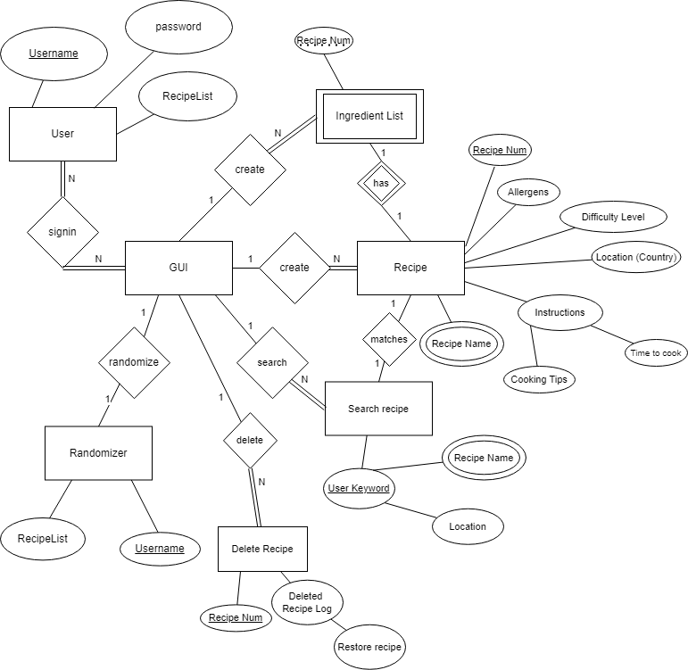

**Application Program Design**

Login()

> name = prompt for username
>
> password = prompt for password
>
> if (username = query user table for match)
>
> logged_in = true
>
> else
>
> display error message

addRecipe()

// read in the following class Recipe variables

name, arr\[str\] ingredients, instructions, location, taste type (salty,
sweet, spicy, etc),

helpful tips: prompt for all

if(name == existing recipe)

print("Recipe exists, please edit instead.")\
else if (name != existing recipe)

print("Recipe added.")

else

print("Error adding recipes. Check inputs.")

search()

// input name and search in database\
name = prompt for name

if(name == existing recipe)\
show recipelist.recipe

else

print("Recipe does not exist. Create the recipe first.")

list()

name = input recipe name

if(name == existing recipe)\
show recipelist.recipe.ingredientlist

else

print("Recipe does not exist. Create the recipe first.")

delete()

name = input recipe name

if(name == existing recipe)\
delete recipelist.recipe

else

print("Recipe does not exist. Create the recipe first.")

edit()

name = prompt name

if(name == existing recipe)\
show recipe editing gui

else

print("Recipe does not exist. Create the recipe first.")

randomizer()

taste_type: prompt for input, can be NULL

location: prompt for input, can be NULL

disp(recipelist.randomrecipe)

**Aggregate Functions\
**

[Get average difficulty value]{.underline}: will return average of
difficulty values for recipes for 1 user.

[Get most common location]{.underline}: return the location with the
most dishes with that location (country)

**Logical Database Design**

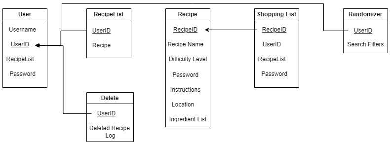

**Table of Data Types**

  -----------------------------------------------------------------------
  **Table**         **Attribute**     **Type**          **Constraint**
  ----------------- ----------------- ----------------- -----------------
  User              Username          CHAR(80)          NOT NULL

  User              User_ID           CHAR(80)          Primary Key

  User              Password          CHAR(80)          NOT NULL

  Recipe List       UserID            CHAR(80)          Primary Key

  Recipe            RecipeID          CHAR(80)          Primary Key

  Recipe            Recipe name       CHAR(80)          NOT NULL

  Recipe            Difficulty Level  INTEGER           

  Recipe            Instructions      CHAR(80)          NOT NULL

  Recipe            Location          CHAR(80)          

  Shopping List     RecipeID          CHAR(80)          Primary Key

  Randomizer        UserID            CHAR(80)          Primary Key
  -----------------------------------------------------------------------

**[Installation Instructions\
]{.underline}**

For this program, you will need MySql and a number of libraries to
interact with the server and client. Below is the link to download
MySql:\
[[MySql Download
Link]{.underline}](https://dev.mysql.com/downloads/file/?id=526407)

Make sure when creating the root user, your password will look like
this:\
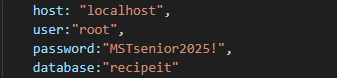\
When creating a new database, it should look like this:\
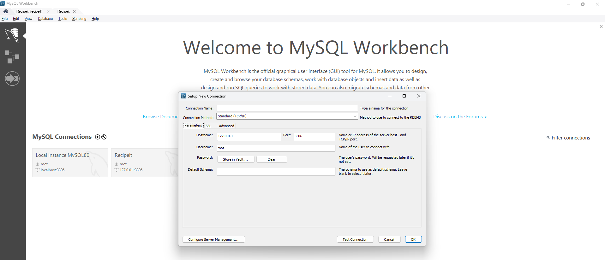

Make sure to fill out as following:\
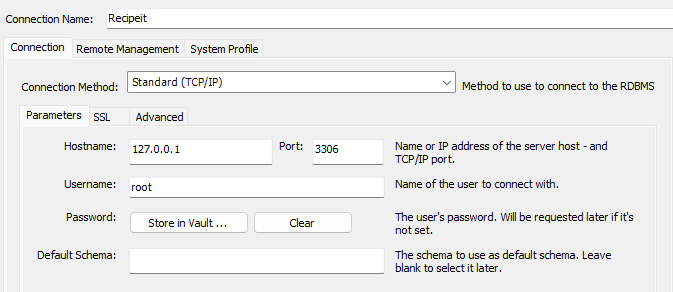

Then, download the zip folder and unzip the files. In the Navigation
menu when you open up your newly created database, there is an
administration tab here:

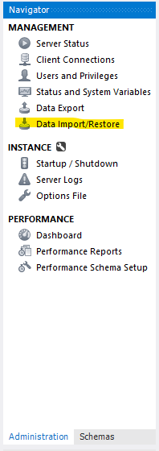\
Click on it, and click data import/restore. This screen will show up:\
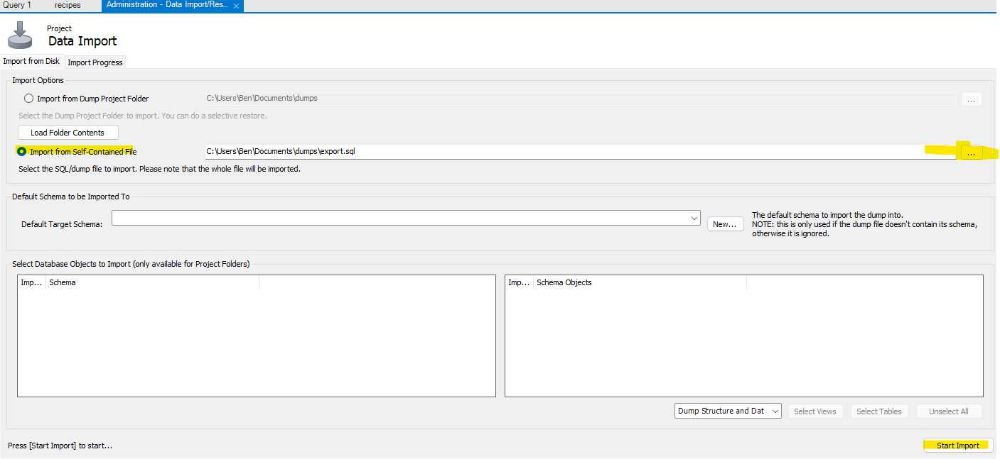\
\
Click Import from self-contained file, browse where it is, and then
click start import.

You should then see the database populated with the recipes table and
the basic two entries I included:\
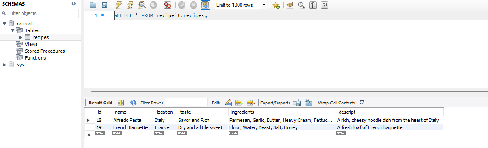

Next, open up 2 windows of Windows Powershell. Navigate to where the
client and server folders are in the Recipeit folder. Before running
anything, install Node.js here:
[[Node.js]{.underline}](https://nodejs.org/en)\
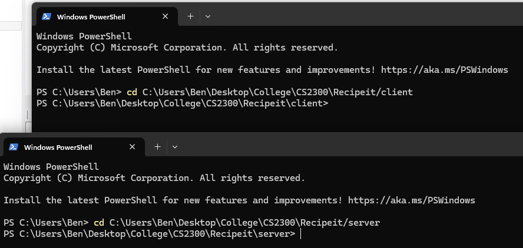

In the client directory of Recipiet, run: npm install. This will
download dependencies in the package.json file in the client directory.
In the server directory, do the same thing. Also in the server
directory, run: npm install axios cors. This will install axios and cors
for the project, essential elements for database integration to the
client side.

You will then start with the server directory. Run: npm run start. Then,
go to the Powershell window on the client directory and run the same:
npm run start. It will prompt you if you want to use a different port,
type 'y' for yes and enter. It will then open up a browser window with
the 2 entries I provided.

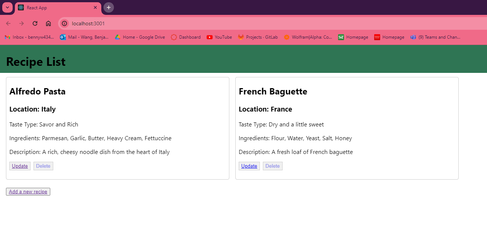

There are a couple functions for you, you can update a recipe, delete
one of the existing recipes (there is no undo, careful!), and add a new
recipe.

**[Update Function]{.underline}**

The update function starts when you click the update button. Here is the
screen for that:\
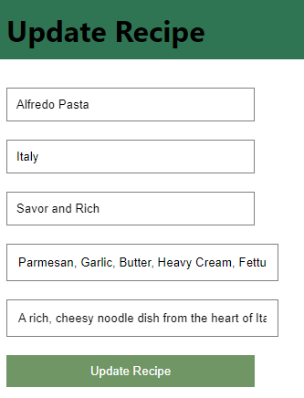\
It will automatically fill what the entry is already, and you can edit
how you wish. Empty fields work as well.

**[Add Function]{.underline}**

The update function starts when you click the update button. Here is the
screen for that:

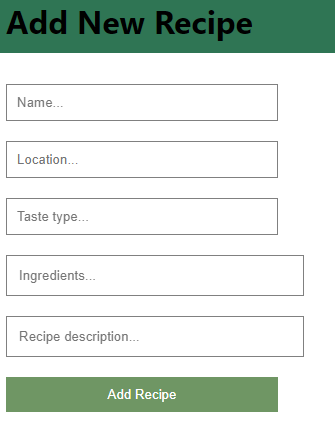
The entry is sent and updated in the database you created immediately.
